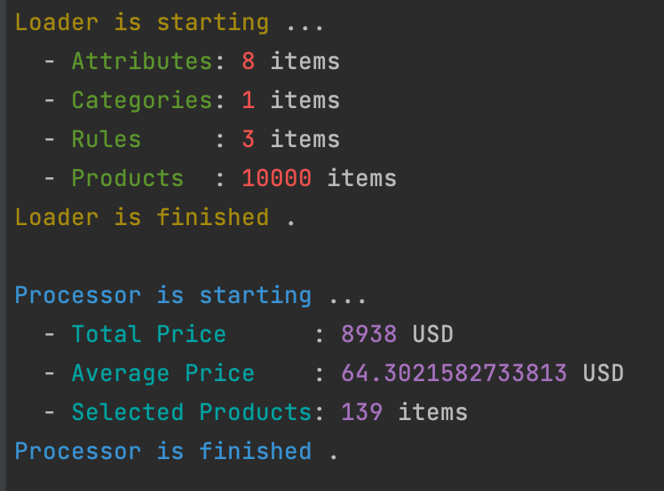

# Dynamic Attribute Manager
It manages attributes for entities as PoC

## Pre-Requisite
- `Latest version of Node` [Download](https://nodejs.org/en/download/)

## Utility Commands
- `npm i` *// Install dependencies* 
- `npm run clear` *// Clears dist folder*
- `npm run lint` *// Executes Eslint, static code analysis*
- `npm run test` *// Runs test cases*
- `npm run coverage` *// Executes test coverage calculation*

## Run
- `npm run start` *// Starts application*

## Response Model
```yaml
--
totalPrice: 8938
selectedProducts: 139
averagePrice: 64.3021582733813
```


## Standards
- Language: `TS`
- Eslint: `Yes`
- Static Code Analysis: `Yes` *IntelliJ Code Inspections*
- 12FA - 12 Factor-App: *Partially*
- **D**DD - Document Driven: `Yes`
- **D**DD - Domain Driven: `Yes`
- **D**DD - Data Driven: ~~NO~~
- **E**DD - Exception Driven: `Yes`
- **E**DD - Event Driven: ~~NO~~
- **L**DD - Log Driven: *Partially*
- **T**DD - Test Driven: `Yes`

## ERD Diagram
- You can review [data-structure-diagram.pdf](./data/data-structure-diagram.pdf)
## Domains
- `Attribute` *Attribute, fields and property responsibility*
  - Samples: price, weight, stock, ...
- `Category` *Category/Cluster responsibility* **@TODO**
  - Samples: shoe, car, phone, ...
  - Category must have attribute assignment to manage product filters
- `Condition` *Condition in a rule*
  - Pattern: `field` `equation` `value`
  - Sample:
    - `weight > 100`
    - `price == 200`
    - `color <> red`
- `Data Type` *Data type enum*
  - Keys: `STRING`, `DOUBLE`, `BOOLEAN`, `INTEGER`, `ENUM`
- `Equation` *Equation or operation enum*
    - Keys: `EQUALS`, `NOT_EQUAL`, `GT`, `GTE`, `LT`, `LTE`, `IN`, `NOT_IN`
    - Alternatives: `==`, `!=`, `<>`, `>`, `>=`, `<`, `<=`
- `Product` *Product entity*
  - Product may have one or more properties
  - Each property should be defined as an attribute
  - Each product must have `category` and `price` property
- `Rule` *Rule entity*
  - Rule must have at least one condition
- `Validation` *Validator enumeration and mapping* **@TODO**
  - Keys: `REQUIRED`, `MIN`, `MAX`, `MIN_LENGTH`, `MAX_LENGTH`, `MIN_ITEMS`, `MAX_ITEMS`
  - Each attribute can have one or more validations
- `Wrap` *Wrap enumeration for property values* **@TODO**
    - Keys: `PLAIN`, `ARRAY`, `MAP`, `I18N`
    - Only plain type is developed

## Offset Data
### Attribute Sample
- File: [attributes.yaml](./src/assets/attributes.yaml)

```yaml
- name: brand
  wrap: PLAIN
  type: STRING
- name: color
  wrap: PLAIN
  type: ENUM
  keys:
    - Black
    - Blue
    - Green
    - Grey
    - Ivory
    - Khaki
    - Navy
    - Red
    - White
    - Yellow
```

### Category Sample
- File: [categories.yaml](./src/assets/categories.yaml)

```yaml
- name: shoe
  attributes:
    - code
    - brand
    - color
    - price
    - currency
    - stock
    - inStock
    - sizes
```


### Rule Sample
- File: [rules.yaml](./src/assets/rules.yaml)

```yaml
// adidas shoes that cost more than 55 usd
- isNegate: false
  score: 100
  conditions:
    - field: brand
      equation: EQUALS
      value: Adidas
    - field: price
      equation: GT
      value: 55
```

### Product Sample
- File: [products.csv](./src/assets/products.csv)

```yaml
- code: SKU06234
  brand: Diadora
  category: shoe
  color: Green
  price: 34
  currency: USD
  stock: 23
  inStock: true
  sizes:
    - S
    - M
    - L
    - XL
```

## Dependencies
- `csv-parse` *CSV parser*
- `js-yaml` *YAML parser*
- `cli-color` *Command line colors*

## Resource

> Offset data was parepared with using [data.world](https://data.world/)

## TODO
- Array, Map and I18n `wrap` implementation
- Implementation for `validation`
- Integrating `data source`
- Rule `parser` from plain text

---
### Prepared by
- Mustafa Yelmer
- mustafayelmer(at)gmail.com
- `2023-02-26`